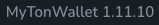
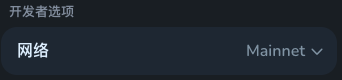
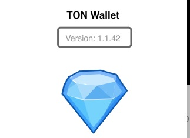
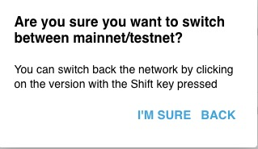

# Ton 钱包使用方法

-   ### 安装钱包插件, 并切换到 Testnet

    -   #### 下载 Chrome 插件: [MyTonWallet](https://chrome.google.com/webstore/detail/mytonwallet-%C2%B7-my-ton-wall/fldfpgipfncgndfolcbkdeeknbbbnhcc), 并按照提示生成一个钱包地址
    -   #### [MyTonWallet](https://chrome.google.com/webstore/detail/mytonwallet-%C2%B7-my-ton-wall/fldfpgipfncgndfolcbkdeeknbbbnhcc)默认是主网, 切换到测试网步骤
        -   #### 点击插件搜索栏旁边的 设置按钮, 并点击设置
        -   #### 找到版本号的位置 , 使用鼠标左键快速点击 5 次, 让其进入开发者模式
        -   #### 弹出的开发者选项中 , 选择 `Testnet`即可
    -   #### [TonWallet](https://chrome.google.com/webstore/detail/ton-wallet/nphplpgoakhhjchkkhmiggakijnkhfnd) 切换测试网步骤
        -   #### 点击状态栏旁边的  设置按钮, 并点击 About
        -   #### 找到版本号的位置 , 按住键盘`Shift`, 并点击鼠标左键点击版本号
        -   #### 弹出 , 并点击 `I'M SURE`即可切换到测试网

-   ### 激活钱包

    -   #### 在 ton 测试网 Testnet 中, 可以到 [Telegram](https://t.me/testgiver_ton_bot) 水龙头获取测试币
    -   #### 领取到测试币之后, 在 [Testnet 的 tonscan](https://testnet.tonscan.org/) 中可以看到`余额`/`State`/`CONTRACT`. 其中 `State` 状态是 `Inactive`, `CONTRACT` 是`空内容`
    -   #### 使用插件 MyTonWallet, 复制当前地址, 并选择`发送`, 给当前地址发送 0.001 的 ton
    -   #### 交易确认之后, 在[Testnet 的 tonscan](https://testnet.tonscan.org/) 中可以看到`State` 状态是 `Active`, `Contract Type`版本是 `wallet v3 r2`, 并且在 `CONTRACT` 中填充了 `Bytecode` 和 `Raw data`
    -   #### 至此, 钱包激活完毕! ton 钱包的激活条件是该地址需要创建一条交易, TVM 自动会补充该地址的合约内容. [参考说明](https://github.com/ton-community/tutorials/blob/main/01-wallet/index.md#:~:text=So%20when%20is,the%20first%20transfer.)

-   ### 使用 ton SDK
    -   #### 官方入门教程: [文档](https://ton-community.github.io/tutorials/01-wallet/)、[Github](https://github.com/ton-community/tutorials)、[个人整理的脚本](https://github.com/W3Tools/ton-contract)
    -   #### Tips1: 官方教程中使用的 SDK 版本是 [WalletContractV4](https://github.com/ton-blockchain/wallet-contract/tree/v4r2-stable), 但是通过[MyTonWallet](https://chrome.google.com/webstore/detail/mytonwallet-%C2%B7-my-ton-wall/fldfpgipfncgndfolcbkdeeknbbbnhcc) 创建的地址是 `v3 r2`, 所以在 SDK 中使用的版本应该是 [WalletContractV3R2](https://github.com/ton-core/ton/blob/master/src/wallets/WalletContractV3R2.ts)
    -   #### Tips2: 相同的助记词, 在不同版本上计算出的地址/私钥会不一样! 参考[说明](https://github.com/ton-community/tutorials/blob/main/01-wallet/index.md#step-5-wallets-contracts-have-versions)
-   ### 交易失败, 在 ton scan 中提示的 Error Code 解释: https://ton.org/docs/learn/tvm-instructions/tvm-exit-codes
-   ### FunC 在 vscode 的插件: `https://marketplace.visualstudio.com/items?itemName=tonwhales.func-vscode`
